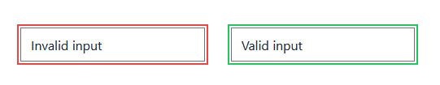

# Tailwindcss-pseudo

Plugin for Tailwind CSS that adds all the different pseudo selectors as variants

## Pseudo classes

This plugin currently includes the following CSS pseudo classes:

```js
[
	"any-link",
	"blank",
	"checked",
	"current",
	"default",
	"defined",
	"dir",
	"drop",
	"empty",
	"enabled",
	"first",
	"first-of-type",
	"fullscreen",
	"future",
	"host",
	"indeterminate",
	"in-range",
	"invalid",
	"lang",
	"last-of-type",
	"left",
	"link",
	"local-link",
	"only-child",
	"only-of-type",
	"optional",
	"out-of-range",
	"past",
	"picture-in-picture",
	"placeholder-shown",
	"read-only",
	"read-write",
	"required",
	"right",
	"root",
	"scope",
	"target",
	"target-within",
	"user-invalid",
	"valid",
];
```

## Usage

### Install

#### NPM

```sh
npm install tailwindcss-pseudo --save-dev
```

#### Yarn

```sh
yarn add tailwindcss-pseudo -D
```

### Configuration

```js
module.exports = {
	theme: {},
	variants: {
		extend: {
			ringColor: ["valid", "invalid"],
		},
	},
	plugins: [require("tailwindcss-pseudo")],
};
```

### HTML

```html
<div class="space-x-8">
	<input
		type="email"
		minlength=""
		value="Invalid input"
		class="invalid:ring-2 invalid:ring-offset-2 invalid:ring-red-500"
	/>
	<input
		type="text"
		value="Valid input"
		class="valid:ring-2 valid:ring-offset-2 valid:ring-green-500"
	/>
</div>
```

And the result would look like this:



### License

MIT
